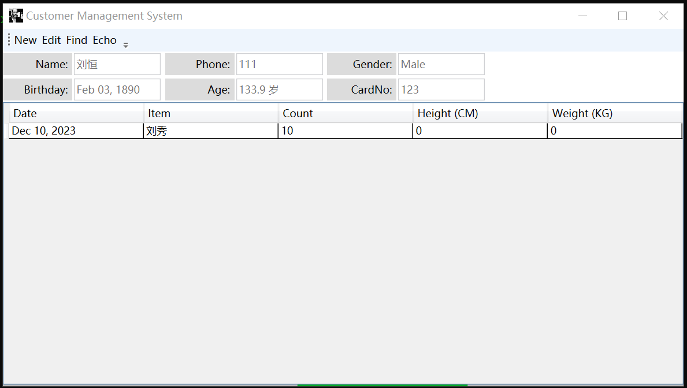
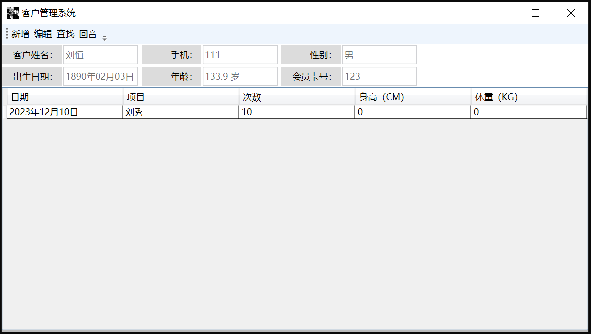
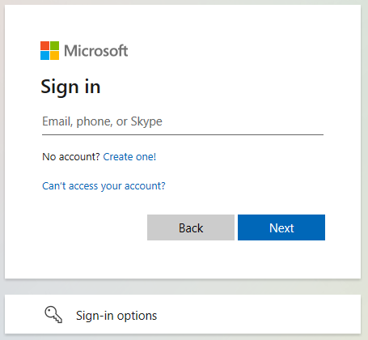

# Leo: A toy project for learning programming.



```console
$ tree  -L 2
.
├── global.json
├── leo.sln
├── LICENSE
├── mainwindow.png
├── mainwindow.zh-CN.png
├── README.md
├── src
│   ├── Leo.Data.Domain
│   ├── Leo.UI.Services
│   ├── Leo.Web
│   ├── Leo.Web.Api
│   ├── Leo.Web.Data
│   ├── Leo.Web.Data.SQLite
│   ├── Leo.Web.Host
│   ├── Leo.Windows.App
│   └── Leo.Wpf.App
└── test
    ├── Leo.Data.Domain.Tests
    └── Leo.Web.Api.Tests

14 directories, 6 files
```

* `Leo.Windows.App` is a WinForms-based application.
* `Leo.Wpf.App` is a WPF-based application.
* `Leo.Web.Host` is a ASP.NET Core application.

NOTE: For simplify, the desktop application also launchs the Web API application in the same one process.

NOTE: You can see more information about how to launch both the Desktop application and a backend Web API service application in one process at `Leo.Windows.Program.Main` and `Leo.Wpf.App.App`.

When the application starts, it requires to login with a Microsoft account (an organization or personal account).



After login succeeded, we will enter the main window. On the main window, we can create an new customer or click the `Find` menu at the toolbar to find a and load a existed customer.